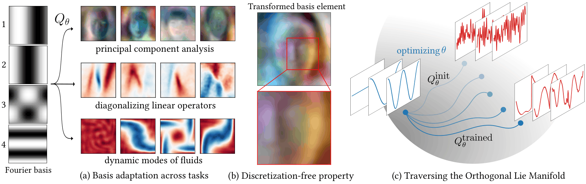

# Learning Orthonormal Bases for Function Spaces



Code for the paper *Learning Orthonormal Bases for Function Spaces*.

We learn an orthogonal change-of-basis $Q_\theta$ in the function space
$L^2(\Omega)$ that maps an initial analytic dictionary (e.g. Fourier)
into a new basis better suited to a downstream task, while exactly
preserving every $L^2$ inner product. Given an initial orthonormal
basis $\{\phi_k\}$, the learned basis is $\{Q_\theta\phi_k\}$ where $Q_\theta$ is
parameterized by the Cayley map of a low-rank skew-adjoint generator.
The isometry constraint $Q_\theta^\ast Q_\theta = I$ holds by construction, not as a
soft penalty.

The repository covers four applications:

| Task | Script | Hydra experiment | Notebook |
|---|---|---|---|
| Functional PCA | `fpca.py` | `+fpca_experiment=...` | `notebooks/fpca_*.ipynb`, `notebooks/inr_fpca.ipynb` |
| NTK diagonalisation | `reg_cob.py` | `+ntk_experiment=two_moons` | `notebooks/ntk.ipynb` |
| Volume-preserving change-of-basis | `reg_cob.py` | `+vortex_experiment=...` / `+euclidean_group=...` | `notebooks/volume_preserving.ipynb` |
| Concept basis (text-conditioned) | `concept_basis.py` | `+concept_experiment=sds` | `notebooks/concept_basis.ipynb` |

---

## Setup

```bash
conda env create -f environment.yml
conda activate infidictionary
```

The environment pins PyTorch (CUDA 12), Hydra, Hugging Face `datasets`,
`diffusers` (used by SDS), `clip`, and the W&B client.

---

## Quick start

All training scripts use [Hydra](https://hydra.cc/) for config
composition and [W&B](https://docs.wandb.ai/) for logging (off by
default — pass `wandb=enabled` to turn it on). Inline overrides work
on every command: just append `key=value`.

### Functional PCA (`fpca.py`)

Jointly trains a `NeuralIsometry` and a learnable mean function so the
captured energy is maximized on the data pulled back through $Q_\theta$.

```bash
# 1D toy class with a step discontinuity
python fpca.py +fpca_experiment=1d_fpca

# CelebA-HQ at 64×64 (downloads via Hugging Face on first run)
python fpca.py +fpca_experiment=celeba_eulerian

# DWSNets MNIST INRs (see "Datasets" below for the data download)
python fpca.py +fpca_experiment=dwsnets_mnist_eulerian

# Implicit-Zoo CIFAR-10 INRs
python fpca.py +fpca_experiment=implicit_zoo_cifar_eulerian
```

### Regularizer-based change-of-basis (`reg_cob.py`)

Minimizes a geometric energy $E(Q)$ over the isometry.

```bash
# Volume-preserving: Taylor–Green vortex flow
python reg_cob.py +vortex_experiment=taylor_green

# Volume-preserving: rigid mirror of the torus
python reg_cob.py +euclidean_group=mirroring

# NTK diagonalisation around a frozen two-moons classifier
# (train the classifier first; see notebooks/ntk.ipynb cell "training")
python reg_cob.py +ntk_experiment=two_moons \
    regularizer.ntk_model_weights_path=outputs/ntk/two_moons_step_5000.pt
```

### Concept basis (`concept_basis.py`)

Steers the basis so random sparse linear combinations render as a target
text concept. Defaults to Score Distillation Sampling against
`runwayml/stable-diffusion-v1-5`, so a GPU with ~12 GB VRAM is needed.

```bash
python concept_basis.py +concept_experiment=sds
# Override the prompt:
python concept_basis.py +concept_experiment=sds caption="a sketch of a cat"
```

### Resuming a run & Checkpointing

Each run writes to `outputs/checkpoints/<run_name>/`. With
`wandb=enabled`, the run name is `wandb-<id>` so resumption restores the
W&B run as well.

```bash
python fpca.py +fpca_experiment=celeba_eulerian \
    resume_training.enabled=true \
    resume_training.checkpoint_path=outputs/checkpoints/<run_name>/step_NNN.pt
```

---

## Datasets

Some notebooks/configs load external datasets. The configs assume the
files live under `data/`:

- **CelebA-HQ** — pulled automatically from the
  [`mattymchen/celeba-hq`](https://huggingface.co/datasets/mattymchen/celeba-hq)
  dataset on Hugging Face on first use.
- **DWSNets MNIST INRs** — download `mnist-inrs.zip`
  ([Dropbox](https://www.dropbox.com/sh/56pakaxe58z29mq/AABtWNkRYroLYe_cE3c90DXVa?dl=0))
  and unzip into `data/mnist-inrs/`.
- **Implicit-Zoo CIFAR-10 INRs** — download `archive.zip` from the
  [Kaggle dataset](https://www.kaggle.com/datasets/alexanderqi/cifar10-inrs-dataset)
  and place at `data/archive.zip` (no extraction needed).

The 1D and torus-flow experiments are fully synthetic — no downloads.

---

## Notebooks

The notebooks under [`notebooks/`](./notebooks/) reproduce every figure
in the paper from a saved checkpoint. They expect a checkpoint produced
by one of the training scripts above; point each notebook at its
checkpoint via the `parameters`-tagged cell at the top.

| Notebook | Loads checkpoint from |
|---|---|
| [`fpca_1d.ipynb`](notebooks/fpca_1d.ipynb) | `fpca.py +fpca_experiment=1d_fpca` |
| [`inr_fpca.ipynb`](notebooks/inr_fpca.ipynb) | `fpca.py +fpca_experiment={dwsnets_mnist,implicit_zoo_cifar}_eulerian` |
| [`fpca_celeba.ipynb`](notebooks/fpca_celeba.ipynb) | `fpca.py +fpca_experiment=celeba_eulerian` |
| [`ntk.ipynb`](notebooks/ntk.ipynb) | `reg_cob.py +ntk_experiment=two_moons` (and an in-notebook two-moons classifier) |
| [`volume_preserving.ipynb`](notebooks/volume_preserving.ipynb) | `reg_cob.py +vortex_experiment=taylor_green` and `+euclidean_group=mirroring` |
| [`concept_basis.ipynb`](notebooks/concept_basis.ipynb) | `concept_basis.py +concept_experiment=sds` |
| [`eulerian_transform.ipynb`](notebooks/eulerian_transform.ipynb) | Just a guide on how to use the model |

Shared visualisation helpers live in
[`notebooks/notebook_helpers.py`](notebooks/notebook_helpers.py).

---

## Repository layout

```
.
├── fpca.py                  # Functional PCA training loop
├── reg_cob.py               # Regularizer-based change-of-basis
├── concept_basis.py         # SDS / CLIP concept basis training
├── training_utils.py        # tiny grad-norm / scheduler helpers
├── conf/                    # Hydra configs (see CLAUDE.md for layout)
├── infidictionary/          # core library
│   ├── neural_isometries/   # NeuralIsometry base + EulerianIsometry
│   ├── networks/            # TimeEvolvingField subclasses, NTK MLP
│   ├── dictionaries/        # InfiDictionary base + FourierDictionary
│   ├── datasets/            # CelebA-HQ, INR-zoo MNIST/CIFAR, 1D synthetic
│   ├── regularizers/        # NTK / TaylorGreenVortex / EuclideanGroup
│   ├── concept.py           # SDSLoss, CLIPLoss, coefficient priors
│   ├── domain_samplers.py   # Square / line samplers
│   ├── recon.py             # reconstruction helpers used by notebooks
│   ├── ntk.py               # empirical NTK estimator
│   ├── utils.py             # norm / inner-product helpers
│   └── checkpointing.py     # save / restore + best-of tracking
├── notebooks/               # paper-figure notebooks + helpers + a quick guide to the API
└── assets/                  # images used by notebooks
```

`CLAUDE.md` contains a longer architectural walkthrough (intended for
contributors / agents working or reading the repo).
